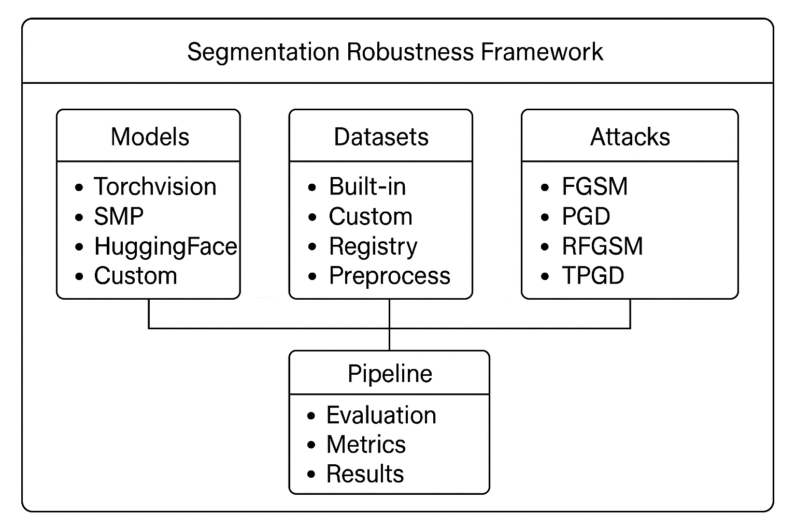

[](https://www.python.org/downloads/release/python-3120/)
[](https://pytorch.org/)
[](https://pypi.org/project/segmentation-robustness-framework/)
[](https://segmentation-robustness-framework.readthedocs.io/en/latest/)
[](https://docs.astral.sh/ruff/)
[](LICENSE)

# Segmentation Robustness Framework Documentation

Welcome to the comprehensive documentation for the **Segmentation Robustness Framework** - a powerful toolkit for evaluating the robustness of semantic segmentation models against adversarial attacks.

## 🚀 Quick Start

Get started in minutes with our comprehensive examples:

```python
from segmentation_robustness_framework.engine.pipeline import SegmentationRobustnessPipeline
from segmentation_robustness_framework.utils.metrics import MetricsCollection
from segmentation_robustness_framework.attacks import FGSM
from segmentation_robustness_framework.datasets import VOCSegmentation
from segmentation_robustness_framework.loaders.models.universal_loader import UniversalModelLoader
from segmentation_robustness_framework.utils import image_preprocessing
import torch

# Load model with universal loader
loader = UniversalModelLoader()
model = loader.load_model(
    model_type="torchvision",
    model_config={"name": "deeplabv3_resnet50", "num_classes": 21}
)

# Set device and move model to it (IMPORTANT: Do this before creating attacks!)
device = "cuda" if torch.cuda.is_available() else "cpu"
model = model.to(device)

# Setup dataset with preprocessing
preprocess, target_preprocess = image_preprocessing.get_preprocessing_fn(
    [512, 512], dataset_name="voc"
)
dataset = VOCSegmentation(
    split="val", 
    root="path/to/existing/VOCdevkit/VOC2012/",
    transform=preprocess,
    target_transform=target_preprocess
)

# Setup attack and metrics (attacks will use the same device as the model)
attack = FGSM(model, eps=2/255)

# Setup metrics
metrics_collection = MetricsCollection(num_classes=21)
metrics = [metrics_collection.mean_iou, metrics_collection.pixel_accuracy]

# Create and run pipeline
pipeline = SegmentationRobustnessPipeline(
    model=model,
    dataset=dataset,
    attacks=[attack],
    metrics=metrics,
    batch_size=4,
    device=device
)

results = pipeline.run(save=True, show=True)
pipeline.print_summary()
```

## 📚 Documentation Structure

### 🎯 **Getting Started**
- **[Installation Guide](https://segmentation-robustness-framework.readthedocs.io/latest/installation/)** - Setup and installation instructions
- **[Quick Start Guide](https://segmentation-robustness-framework.readthedocs.io/latest/quickstart/)** - Your first evaluation in 5 minutes
- **[Framework Concepts](https://segmentation-robustness-framework.readthedocs.io/latest/concepts/)** - Core framework concepts and architecture

### 📖 **User Guides**
- **[User Guide](https://segmentation-robustness-framework.readthedocs.io/latest/user_guide/)** - Complete guide for using the framework
- **[Custom Components](https://segmentation-robustness-framework.readthedocs.io/latest/custom_components/)** - Adding your own datasets, models, and attacks

### 🎓 **Learning Path**

1. **Start Here**: [Installation Guide](https://segmentation-robustness-framework.readthedocs.io/latest/installation/) → [Quick Start](https://segmentation-robustness-framework.readthedocs.io/latest/quickstart/)
2. **Basic Usage**: [User Guide](https://segmentation-robustness-framework.readthedocs.io/latest/user_guide/)
3. **Custom Components**: [Custom Components](https://segmentation-robustness-framework.readthedocs.io/latest/custom_components/)

## 🎯 **Key Features**

### **🔬 Comprehensive Evaluation**
- **Multiple Attacks**: FGSM, PGD, RFGSM, TPGD, and custom attacks
- **Rich Metrics**: IoU, pixel accuracy, precision, recall, dice score
- **Flexible Output**: JSON, CSV
- **Batch Processing**: Efficient evaluation of large datasets

### **🏗️ Universal Model Support**
- **Torchvision Models**: DeepLab, FCN, LRASPP architectures
- **SMP Models**: UNet, LinkNet, PSPNet, and more
- **HuggingFace Models**: Transformers-based segmentation models
- **Custom Models**: Easy integration with your own models

### **📊 Built-in Datasets**
- **VOC**: Pascal VOC 2012 (21 classes)
- **ADE20K**: Scene parsing dataset (150 classes)
- **Cityscapes**: Urban scene understanding (35 classes)
  - *Note: Cityscapes cannot be downloaded automatically due to required authorization. You must register and download it manually from https://www.cityscapes-dataset.com/.*
- **Stanford Background**: Natural scene dataset (9 classes)

### **⚡ Easy Integration**
- **Registry System**: Automatic discovery of custom components
- **Adapter Pattern**: Standardized model interfaces
- **Preprocessing Pipeline**: Automatic data normalization and conversion
- **Error Handling**: Comprehensive error messages and debugging

## 🚀 **Quick Examples**

### **Basic Evaluation**
```python
# Load components
from segmentation_robustness_framework import *

# Setup pipeline
pipeline = SegmentationRobustnessPipeline(
    model=load_model(),
    dataset=load_dataset(),
    attacks=[FGSM(model, eps=2/255)],
    metrics=[mean_iou, pixel_accuracy]
)

# Run evaluation
results = pipeline.run()
```

### **Custom Dataset**
```python
@register_dataset("my_dataset")
class MyDataset(Dataset):
    def __init__(self, root, transform=None):
        self.num_classes = 5
        # ... implementation
    
    def __getitem__(self, idx):
        return image, mask
```

### **Custom Attack**
```python
@register_attack("my_attack")
class MyAttack(AdversarialAttack):
    def apply(self, images, labels):
        # Implement attack logic
        return adversarial_images
```

### Custom Model Example
```python
# Register and use a custom adapter for your model
from segmentation_robustness_framework.adapters import CustomAdapter
from segmentation_robustness_framework.adapters.registry import register_adapter

@register_adapter("my_custom_adapter")
class MyCustomAdapter(CustomAdapter):
    pass  # Optionally override methods if your model's output format is different

# Use your custom adapter with the universal loader
loader = UniversalModelLoader()
model = loader.load_model(
    model_type="my_custom_adapter",
    model_config={
        "model_class": "path.to.MyCustomModel",
        "model_args": [21],
        "model_kwargs": {"pretrained": True}
    }
)

# Set device and create attacks
device = "cuda" if torch.cuda.is_available() else "cpu"
model = model.to(device)
attacks = [FGSM(model, eps=2/255)]

pipeline = SegmentationRobustnessPipeline(
    model=model, dataset=dataset, attacks=attacks, metrics=metrics, device=device
)
results = pipeline.run()
```

## 🛠️ **Installation**

```bash
# Install from PyPI
pip install segmentation-robustness-framework

# Or install from source
git clone https://github.com/your-repo/segmentation-robustness-framework
cd segmentation-robustness-framework
pip install -e .
```

## 📖 **Framework Architecture**

The framework follows a modular architecture with clear separation of concerns:



## 🤝 **Contributing**

We welcome contributions! Please see our contributing guidelines for details on:
- Code style and standards
- Testing requirements
- Documentation guidelines
- Pull request process

## 📞 **Support**

- **Documentation**: Browse the guides above
- **Issues**: Report bugs and request features on GitHub
- **Discussions**: Join our community discussions

## 📄 **License**

This project is licensed under the MIT License - see the LICENSE file in the project root for details.

---

**Ready to evaluate your segmentation models?** 🚀

Start with our [Quick Start Guide](https://segmentation-robustness-framework.readthedocs.io/latest/quickstart/) and have your first evaluation running in minutes!
