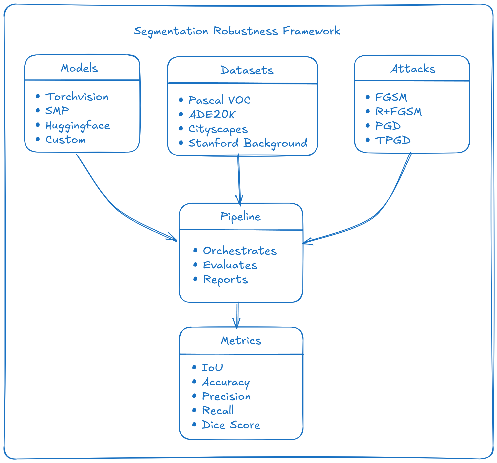

# Segmentation Robustness Framework Documentation

Welcome to the comprehensive documentation for the **Segmentation Robustness Framework** - a powerful toolkit for evaluating the robustness of semantic segmentation models against adversarial attacks.

## 🚀 Quick Start

Get started in minutes with our comprehensive examples:

```python
from segmentation_robustness_framework.engine.pipeline import SegmentationRobustnessPipeline
from segmentation_robustness_framework.utils.metrics import MetricsCollection
from segmentation_robustness_framework.attacks import FGSM
from segmentation_robustness_framework.datasets import VOCSegmentation
from segmentation_robustness_framework.loaders.models.universal_loader import UniversalModelLoader
from segmentation_robustness_framework.utils import image_preprocessing
import torch

# Load model with universal loader
loader = UniversalModelLoader()
model = loader.load_model(
    model_type="torchvision",
    model_config={"name": "deeplabv3_resnet50", "num_classes": 21}
)

# Set device and move model to it (IMPORTANT: Do this before creating attacks!)
device = "cuda" if torch.cuda.is_available() else "cpu"
model = model.to(device)

# Setup dataset with preprocessing
preprocess, target_preprocess = image_preprocessing.get_preprocessing_fn(
    [512, 512], dataset_name="voc"
)
dataset = VOCSegmentation(
    split="val", 
    transform=preprocess,
    target_transform=target_preprocess,
    download=True
)

# Setup attack and metrics (attacks will use the same device as the model)
attack = FGSM(model, eps=2/255)
metrics = [MetricsCollection(num_classes=21).mean_iou]

# Create and run pipeline
pipeline = SegmentationRobustnessPipeline(
    model=model, dataset=dataset, attacks=[attack], metrics=metrics, device=device
)
results = pipeline.run()
```

## 📚 Documentation Structure

### 🎯 Getting Started
- **[Installation Guide](installation.md)** - Install the framework and dependencies
- **[Quick Start Guide](quickstart.md)** - Get up and running in 5 minutes
- **[User Guide](user_guide.md)** - Comprehensive usage guide

### 🏗️ Core Concepts
- **[Framework Concepts](concepts.md)** - Architecture and design principles
- **[Custom Components](custom_components.md)** - Create your own datasets, attacks, and models

<!-- ### 🚀 Advanced Usage
- **[Advanced Usage](advanced_usage.md)** - Performance optimization and production deployment
- **[API Reference](api_reference.md)** - Complete API documentation

### 📖 Examples and Tutorials
- **[Practical Example](practical_example.md)** - Complete end-to-end example
- **[Custom Datasets Guide](custom_datasets_guide.md)** - How to use custom datasets -->

## 🎯 What You Can Do

### 🔧 Model Support
- **Torchvision Models**: DeepLabV3, FCN, LR-ASPP, and more
- **SMP Models**: UNet, LinkNet, PSPNet, and other architectures
- **HuggingFace Models**: SegFormer, MaskFormer, and transformer-based models
- **Custom Models**: Easy integration of your own models

### 📊 Dataset Support
- **Built-in Datasets**: VOC, ADE20K, Cityscapes, Stanford Background
  - *Note: Cityscapes cannot be downloaded automatically due to required authorization. You must register and download it manually from https://www.cityscapes-dataset.com/.*
- **Smart Path Handling**: 
  - `download=True`: Creates organized nested directory structures
  - `download=False`: Uses exact user-specified paths for pre-downloaded datasets
- **Custom Datasets**: Simple integration of your own datasets
- **Automatic Download**: Built-in dataset downloading and preprocessing (except Cityscapes)

### ⚔️ Attack Methods
- **FGSM**: Fast Gradient Sign Method
- **PGD**: Projected Gradient Descent
- **RFGSM**: Random + Fast Gradient Sign Method
- **TPGD**: Theoretically Principled PGD
- **Custom Attacks**: Easy implementation of new attacks

### 📈 Evaluation Metrics
- **Mean IoU**: Intersection over Union (macro/micro averaging)
- **Pixel Accuracy**: Overall pixel-wise accuracy
- **Precision & Recall**: Per-class precision and recall
- **Dice Score**: Dice coefficient for segmentation quality
- **Custom Metrics**: Add your own evaluation metrics

## 🏗️ Framework Architecture



## 🚀 Key Features

### ✅ Easy to Use
- **Simple API**: Clean, intuitive interface
- **Universal Loader**: Load any model type with one interface
- **Automatic Setup**: Handles device placement, data loading, and preprocessing

### 🔧 Highly Extensible
- **Registry System**: Easy to add new components
- **Adapter Pattern**: Standardized model interfaces
- **Plugin Architecture**: Modular design for easy extension

### 📊 Comprehensive Evaluation
- **Multiple Metrics**: IoU, accuracy, precision, recall, dice score
- **Batch Processing**: Efficient evaluation of large datasets
- **Visualization**: Built-in plotting and result analysis

### 🎯 Production Ready
- **Reproducibility**: Version-controlled experiment tracking
- **Performance**: Optimized for speed and memory efficiency

## 📖 Quick Examples

### Basic Evaluation
```python
# Set device first
device = "cuda" if torch.cuda.is_available() else "cpu"
model = model.to(device)

# Simple evaluation with one attack
pipeline = SegmentationRobustnessPipeline(
    model=model,
    dataset=dataset,
    attacks=[FGSM(model, eps=2/255)],
    metrics=[metrics_collection.mean_iou],
    device=device
)
results = pipeline.run()
```

### Multi-Attack Evaluation
```python
# Set device first
device = "cuda" if torch.cuda.is_available() else "cpu"
model = model.to(device)

# Evaluate multiple attacks
attacks = [
    FGSM(model, eps=2/255),
    FGSM(model, eps=4/255),
    PGD(model, eps=4/255, iters=10),
    RFGSM(model, eps=8/255, iters=10)
]

pipeline = SegmentationRobustnessPipeline(
    model=model, dataset=dataset, attacks=attacks, metrics=metrics, device=device
)
results = pipeline.run()
```

### Custom Model Example
```python
# Create a custom adapter for your model
from segmentation_robustness_framework.adapters import CustomAdapter

class MyCustomAdapter(CustomAdapter):
    def logits(self, x: torch.Tensor) -> torch.Tensor:
        # Handle your model's specific output format
        return self.model(x)

# Use your custom adapter
base_model = MyCustomSegmentationModel(num_classes=21)
model = MyCustomAdapter(base_model, num_classes=21)

# Set device and create attacks
device = "cuda" if torch.cuda.is_available() else "cpu"
model = model.to(device)
attacks = [FGSM(model, eps=2/255)]

pipeline = SegmentationRobustnessPipeline(
    model=model, dataset=dataset, attacks=attacks, metrics=metrics, device=device
)
results = pipeline.run()
```

## 🔧 Installation

### Quick Install
```bash
pip install segmentation-robustness-framework[full]
```

### From Source
```bash
git clone https://github.com/your-repo/segmentation-robustness-framework
cd segmentation-robustness-framework
pip install -e .
```

## 🎓 Learning Path

1. **Start Here**: [Installation Guide](installation.md) → [Quick Start](quickstart.md)
2. **Basic Usage**: [User Guide](user_guide.md) → [Custom Components](custom_components.md)
3. **Custom Components**: [Custom Components](custom_components.md) → [Practical Example](practical_example.md)
4. **Advanced Topics**: [Advanced Usage](advanced_usage.md) → [Custom Components](custom_components.md)

## 🤝 Contributing

We welcome contributions! Please see our contributing guidelines for details on:
- Code style and standards
- Testing requirements
- Documentation guidelines
- Pull request process

## 📞 Support

- **Documentation**: Browse the guides above
- **Examples**: Check the [Practical Example](practical_example.md) for complete implementations
- **Issues**: Report bugs and request features on GitHub
- **Discussions**: Join our community discussions

## 📄 License

This project is licensed under the MIT License - see the LICENSE file in the project root for details.

---

**Ready to get started?** Check out our [Quick Start Guide](quickstart.md) or explore the [Practical Example](practical_example.md) for ready-to-run code!
