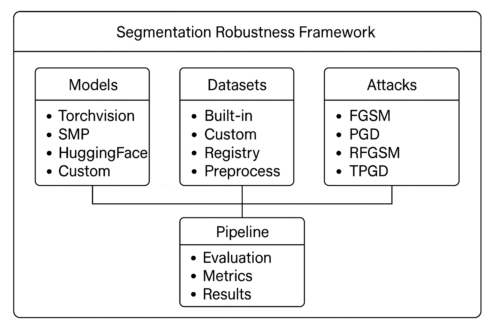

# Framework Concepts

This guide explains the core concepts and architecture of the Segmentation Robustness Framework.

## 🏗️ Architecture Overview

The framework follows a modular, component-based architecture designed for flexibility and extensibility:



## 🔧 Core Components

### 1. Models and Adapters

Models are wrapped with **adapters** to provide a standardized interface:

```python
# Adapter Pattern
class SegmentationModelProtocol(Protocol):
    num_classes: int
    
    def logits(self, x: torch.Tensor) -> torch.Tensor:
        """Return raw model outputs [B, C, H, W]"""
        ...
    
    def predictions(self, x: torch.Tensor) -> torch.Tensor:
        """Return predicted labels [B, H, W]"""
        ...
```

**Why Adapters?**
   
   - **Standardization**: Different model types have different output formats
   - **Compatibility**: Ensures all models work with the same evaluation pipeline
   - **Flexibility**: Easy to add new model types without changing the core framework

**Supported Adapters:**

   - `TorchvisionAdapter`: For torchvision segmentation models
   - `SMPAdapter`: For segmentation_models_pytorch models
   - `HuggingFaceAdapter`: For HuggingFace transformers models
   - `CustomAdapter`: Template for custom models

### 2. Registry System

The framework uses a **registry pattern** for automatic component discovery:

```python
# Register a component
@register_dataset("my_dataset")
class MyDataset(Dataset):
    ...

@register_attack("my_attack")
class MyAttack(AdversarialAttack):
    ...

@register_adapter("my_adapter")
class MyAdapter(SegmentationModelProtocol):
    ...
```

**Benefits:**

   - **Automatic Discovery**: Components are automatically available
   - **Loose Coupling**: Components don't need to import each other
   - **Extensibility**: Easy to add new components without modifying core code

### 3. Pipeline Architecture

The **SegmentationRobustnessPipeline** orchestrates the entire evaluation process:

```python
# Pipeline workflow
1. Load Model → 2. Load Dataset → 3. Setup Attacks → 4. Setup Metrics
                                    ↓
5. Evaluate Clean Performance → 6. Evaluate Attack Performance
                                    ↓
7. Compute Metrics → 8. Save Results → 9. Generate Visualizations
```

## 📊 Data Flow

### Input Processing Pipeline

```
Raw Images/Masks → Preprocessing → Model Input
     ↓
1. Image Normalization (ImageNet stats)
2. Mask Conversion (RGB → indices)
3. Shape Validation
4. Device Transfer (CPU → GPU)
```

### Evaluation Pipeline

```
Clean Evaluation:
Images → Model → Predictions → Metrics → Clean Results

Attack Evaluation:
Images → Attack → Adversarial Images → Model → Adversarial Predictions → Metrics → Attack Results
```

### Output Generation

```
Results → Aggregation → Multiple Formats
  ↓
• JSON (detailed results)
• CSV (comparison tables)
• PNG (visualizations)
• Summary (console output)
```

## 🎯 Key Design Principles

### 1. Separation of Concerns

Each component has a single, well-defined responsibility:

- **Models**: Provide segmentation predictions
- **Datasets**: Supply image-mask pairs
- **Attacks**: Generate adversarial perturbations
- **Metrics**: Compute evaluation scores
- **Pipeline**: Orchestrate the evaluation process

### 2. Interface Consistency

All components follow consistent interfaces:

```python
# Dataset Interface
class Dataset:
    def __getitem__(self, idx) -> tuple[torch.Tensor, torch.Tensor]:
        """Return (image, mask) pair."""
        ...
    
    def __len__(self) -> int:
        """Return the number of samples in the dataset."""
        ...

# Attack Interface
class AdversarialAttack:
    def apply(self, images: torch.Tensor, labels: torch.Tensor) -> torch.Tensor:
        """Return adversarial images."""
        ...

# Metric Interface
def metric(targets: torch.Tensor, predictions: torch.Tensor) -> float:
    """Return metric value."""
    ...
```

### 3. Error Handling

Comprehensive error handling with informative messages:

```python
# Example error handling
try:
    model = loader.load_model(config)
except ValueError as e:
    logger.error(f"Invalid model configuration: {e}")
    # Provide helpful suggestions
except RuntimeError as e:
    logger.error(f"Model loading failed: {e}")
    # Suggest alternative approaches
```

### 4. Extensibility

Easy to extend with new components:

```python
# Add new dataset
@register_dataset("medical")
class MedicalDataset(Dataset):
    # Implementation

# Add new attack
@register_attack("medical_fgsm")
class MedicalFGSM(AdversarialAttack):
    # Implementation

# Add new metric
def medical_metric(targets, predictions):
    # Implementation
    return score
```

## 🔄 Component Lifecycle

### 1. Initialization Phase

```python
# Components are created and validated
pipeline = SegmentationRobustnessPipeline(
    model=model,      # → Validated and wrapped with adapter
    dataset=dataset,  # → Validated and prepared
    attacks=attacks,  # → Validated and configured
    metrics=metrics   # → Validated and prepared
)
```

### 2. Setup Phase

```python
# Pipeline prepares for evaluation
pipeline._setup_metric_names()      # → Assign metric names
pipeline._setup_output_formats()    # → Configure output formats
pipeline._setup_automatic_mask_resizing()  # → Configure mask resizing
```

### 3. Execution Phase

```python
# Evaluation runs
pipeline.evaluate_clean()    # → Clean performance
pipeline.evaluate_attack()   # → Attack performance
pipeline.compute_metrics()   # → Metric computation
```

### 4. Output Phase

```python
# Results are processed and saved
pipeline.save_results()      # → Save to files
pipeline._create_visualizations()  # → Generate plots
pipeline.print_summary()     # → Console output
```

## 🎛️ Configuration Management

### Configuration Hierarchy

```
1. Default Values (hardcoded in classes)
2. User Configuration (passed to constructors)
3. Environment Variables (for system-wide settings)
4. Command Line Arguments (for runtime overrides)
```

## 🔍 Memory Management

### Efficient Processing

```python
# Batch processing to manage memory
for batch in dataloader:
    # Process batch
    results = model(batch)
    # Clear intermediate tensors
    del intermediate_tensors
    torch.cuda.empty_cache()  # If using GPU
```

### Memory Optimization Strategies

1. **Batch Size Adjustment**: Automatic or manual batch size tuning
2. **Gradient Checkpointing**: For large models
3. **Mixed Precision**: For faster computation with less memory
4. **Tensor Reuse**: Minimize tensor allocations

## 🚀 Performance Considerations

### GPU Utilization

```python
# Optimal GPU usage
torch.cuda.set_per_process_memory_fraction(0.8)  # Use 80% of GPU memory
torch.backends.cudnn.benchmark = True  # Optimize for fixed input sizes
```

### Parallel Processing

```python
# Multi-GPU support
model = torch.nn.DataParallel(model)  # Simple multi-GPU
# Or DistributedDataParallel for more advanced scenarios
```

## 🎯 Best Practices

### 1. Component Design

```python
# Good: Clear interface
class MyAttack(AdversarialAttack):
    def apply(self, images, labels):
        # Clear implementation
        return adversarial_images

# Bad: Unclear interface
class MyAttack:
    def do_something(self, data):
        # Unclear what this does
        pass
```

### 2. Error Handling

```python
# Good: Informative errors
if num_classes <= 0:
    raise ValueError(f"num_classes must be positive, got {num_classes}")

# Bad: Generic errors
if num_classes <= 0:
    raise ValueError("Invalid input")
```

### 3. Documentation

```python
# Good: Comprehensive docstrings
def compute_metric(targets, predictions):
    """Compute segmentation metric.
    
    Args:
        targets: Ground truth labels [B, H, W]
        predictions: Predicted labels [B, H, W]
    
    Returns:
        float: Metric value between 0 and 1
    """
    pass
```

## 🔮 Future Extensions

The framework is designed to be easily extensible:

### Planned Features

1. **Distributed Evaluation**: Multi-node evaluation support
2. **Real-time Monitoring**: Live progress and resource monitoring
3. **Advanced Attacks**: More sophisticated adversarial attacks
4. **Custom Metrics**: User-defined evaluation metrics
5. **Web Interface**: GUI for configuration and monitoring

### Extension Points

```python
# Easy to add new components
@register_component("new_type")
class NewComponent:
    # Implementation
    pass

# Easy to add new features
class ExtendedPipeline(SegmentationRobustnessPipeline):
    def new_feature(self):
        # New functionality
        pass
```

---

**Understanding these concepts will help you:**

   - 🎯 Use the framework more effectively
   - 🔧 Extend it with custom components
   - 🚀 Optimize performance for your use case

**Next Steps:**
   
   - 📖 Read the [User Guide](user_guide.md) for practical usage
   - 🔧 Learn about [Custom Components](custom_components.md) for extension
